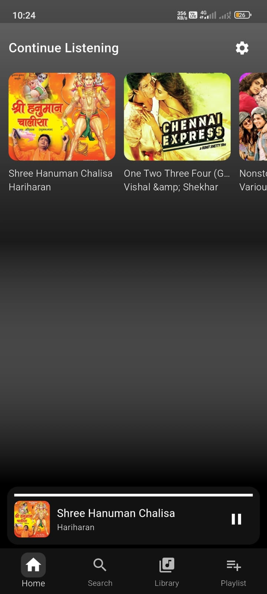
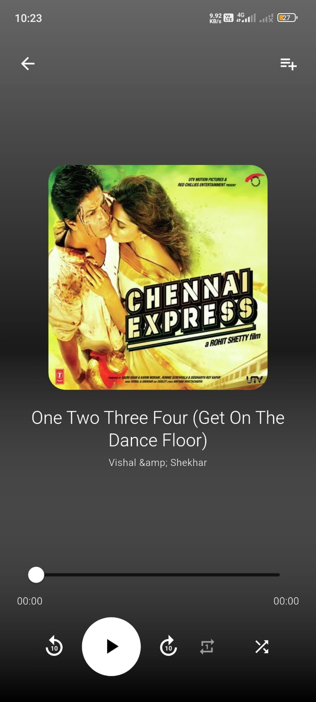
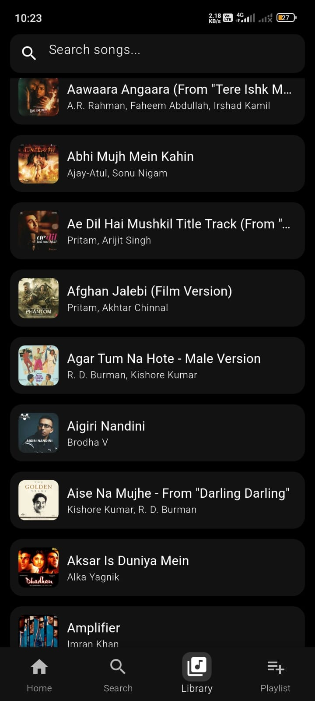

# 🎵 Lofeee – Music Streaming Flutter App

A modern and responsive music streaming application built using **Flutter** with **MVVM Architecture** and **GetX State Management**.

Lofeee provides a smooth and fast music streaming experience with beautiful UI, online song streaming, authentication, playlists, favorites, and real-time backend integration using Supabase.

---

# ✨ Features

- 🎧 Online Music Streaming
- 🔍 Smart Song Search
- ❤️ Favorite Songs
- 📂 Custom Playlists
- 👤 User Authentication
- ☁️ Supabase Backend Integration
- ⚡ Fast & Reactive UI using GetX
- 📱 Fully Responsive Design
- 🎵 Modern Music Player
- 🌙 Clean Dark Theme
- 🔄 Real-Time Data Handling
- 🧠 MVVM Architecture

---

# 🛠️ Tech Stack

| Technology | Usage |
|---|---|
| Flutter | Cross-platform App Development |
| Dart | Programming Language |
| GetX | State Management & Navigation |
| MVVM | Clean Architecture |
| Supabase | Backend & Authentication |
| JioSaavn API | Music Data API |
| ScreenUtil | Responsive UI |
| Cached Network Image | Image Optimization |
| Just Audio | Audio Playback |

---

# 📁 Clean MVVM Project Structure

```bash
lib/
│
├── main.dart
│
├── app/
│   ├── routes/
│   │   ├── app_pages.dart
│   │   └── app_routes.dart
│   │
│   ├── bindings/
│   │   ├── home_binding.dart
│   │   ├── player_binding.dart
│   │   ├── auth_binding.dart
│   │   └── search_binding.dart
│   │
│   └── theme/
│       ├── app_colors.dart
│       ├── app_theme.dart
│       └── text_styles.dart
│
├── data/
│   ├── models/
│   │   ├── song_model.dart
│   │   ├── playlist_model.dart
│   │   ├── artist_model.dart
│   │   └── user_model.dart
│   │
│   ├── services/
│   │   ├── api_service.dart
│   │   ├── supabase_service.dart
│   │   ├── auth_service.dart
│   │   └── audio_service.dart
│   │
│   └── repositories/
│       ├── song_repository.dart
│       ├── auth_repository.dart
│       └── playlist_repository.dart
│
├── modules/
│   │
│   ├── splash/
│   │   ├── views/
│   │   │   └── splash_view.dart
│   │   │
│   │   ├── controllers/
│   │   │   └── splash_controller.dart
│   │   │
│   │   └── bindings/
│   │       └── splash_binding.dart
│   │
│   ├── auth/
│   │   ├── views/
│   │   │   ├── login_view.dart
│   │   │   └── signup_view.dart
│   │   │
│   │   ├── controllers/
│   │   │   └── auth_controller.dart
│   │   │
│   │   └── bindings/
│   │       └── auth_binding.dart
│   │
│   ├── home/
│   │   ├── views/
│   │   │   ├── home_view.dart
│   │   │   ├── widgets/
│   │   │   │   ├── song_tile.dart
│   │   │   │   ├── trending_section.dart
│   │   │   │   └── mini_player.dart
│   │   │
│   │   ├── controllers/
│   │   │   └── home_controller.dart
│   │   │
│   │   └── bindings/
│   │       └── home_binding.dart
│   │
│   ├── player/
│   │   ├── views/
│   │   │   ├── player_view.dart
│   │   │   └── widgets/
│   │   │       ├── player_controls.dart
│   │   │       ├── progress_bar_widget.dart
│   │   │       └── song_info_widget.dart
│   │   │
│   │   ├── controllers/
│   │   │   └── player_controller.dart
│   │   │
│   │   └── bindings/
│   │       └── player_binding.dart
│   │
│   ├── search/
│   │   ├── views/
│   │   │   └── search_view.dart
│   │   │
│   │   ├── controllers/
│   │   │   └── search_controller.dart
│   │   │
│   │   └── bindings/
│   │       └── search_binding.dart
│   │
│   ├── playlist/
│   │   ├── views/
│   │   │   └── playlist_view.dart
│   │   │
│   │   ├── controllers/
│   │   │   └── playlist_controller.dart
│   │   │
│   │   └── bindings/
│   │       └── playlist_binding.dart
│   │
│   └── profile/
│       ├── views/
│       │   └── profile_view.dart
│       │
│       ├── controllers/
│       │   └── profile_controller.dart
│       │
│       └── bindings/
│           └── profile_binding.dart
│
├── core/
│   ├── constants/
│   │   ├── api_constants.dart
│   │   ├── app_constants.dart
│   │   └── storage_constants.dart
│   │
│   ├── utils/
│   │   ├── helpers.dart
│   │   ├── validators.dart
│   │   └── extensions.dart
│   │
│   └── widgets/
│       ├── custom_button.dart
│       ├── custom_textfield.dart
│       ├── loading_widget.dart
│       └── shimmer_widget.dart
│
└── assets/
    ├── images/
    ├── icons/
    ├── fonts/
    └── screenshots/
```

---

# 🏗️ Architecture — MVVM

The project follows **MVVM (Model-View-ViewModel)** architecture for scalable and maintainable code.

## 🔹 Model
Handles:
- API response models
- JSON serialization/deserialization
- Data structures

## 🔹 View
Contains:
- UI screens
- Widgets
- Animations
- Responsive layouts

## 🔹 ViewModel (Controller)
Handles:
- Business logic
- API calls
- State management
- Reactive programming with GetX

---

# ⚡ State Management — GetX

GetX is used for:

- Reactive State Management
- Route Navigation
- Dependency Injection
- Performance Optimization

---

# ☁️ Supabase Integration

Supabase is used for:

- User Authentication
- Database Storage
- Session Management
- Playlist Storage
- Favorite Songs Storage

---

# 🎶 JioSaavn API

Used for fetching:

- Trending Songs
- Albums
- Artists
- Search Results

---

# 📱 Responsive UI

The app uses:

- flutter_screenutil
- Adaptive layouts
- Responsive font scaling

---

# 📸 Screenshots

## 🖼️ Screenshot Layout

<p align="center">
  
  
  
</p>

---

# 📥 Download APK

[Download Lofeee APK](https://drive.google.com/file/d/1h-zTJH4f4wCpCKtYPWF7bxpCtWp4iPuz/view?usp=drivesdk)

---

# ⚙️ Installation

## Clone Repository

```bash
git clone https://github.com/nitin4568/cute_lofee.git
```

## Install Dependencies

```bash
flutter pub get
```

## Run Project

```bash
flutter run
```

---

# 📦 Dependencies

```yaml
dependencies:
  flutter:
    sdk: flutter

  get:
  supabase_flutter:
  flutter_screenutil:
  cached_network_image:
  http:
  just_audio:
  audio_video_progress_bar:
  get_storage:
  flutter_svg:
  shimmer:
```

---

# 🌟 Future Improvements

- 🎵 Offline Downloads
- 📝 Lyrics Support
- 🤖 AI Music Recommendations
- 🎙️ Podcast Integration
- 🎚️ Equalizer Support
- 🌐 Multi-language Support

---

# 👨‍💻 Developer

## Nitin Gautam

Flutter Developer • GetX • Supabase • MVVM Architecture

### 🔗 GitHub Repository

https://github.com/nitin4568/cute_lofee.git